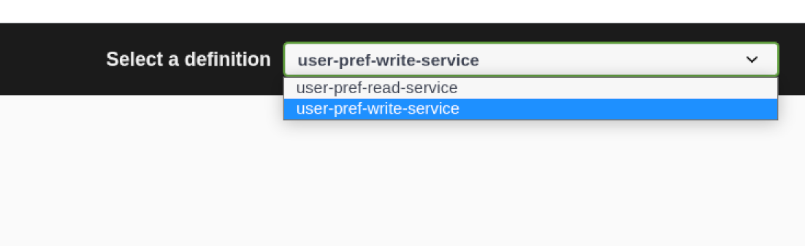
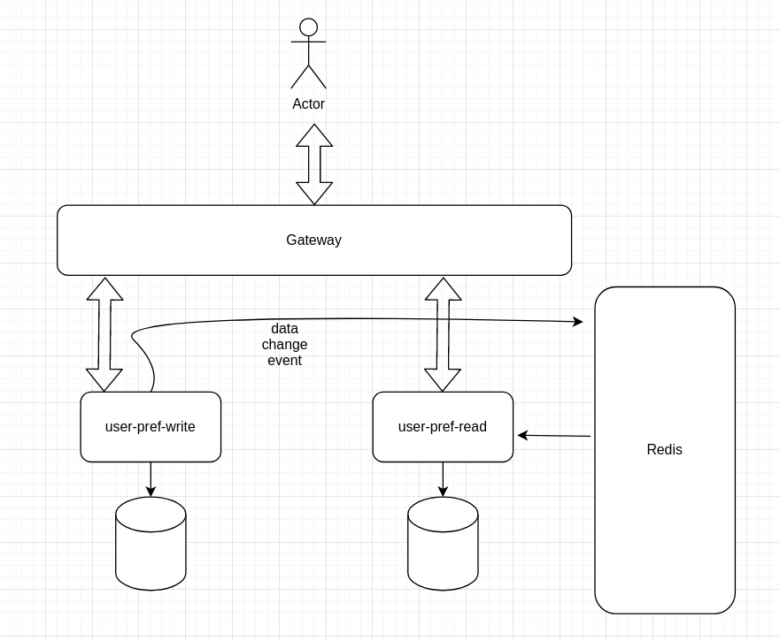

# User Marketing Preference Manager
## Problem:
We would like to build the capability for customers to store their
marketing preferences (post / email / sms). As part of this we need REST APIs to fulfill the
requirements. These APIs will be used by mobile and web applications.
Due to the nature of the traffic, we would like to build this across 2 different micro services.
One Microservice is just to create or update the preferences. Another microservice is to
retrieve the preferences.
Level of abstraction is intentional to give free choice to the candidate to design and develop.
Ideally the candidate will spend no more than 4-5 hours for this exercise.
Technical Requirements:
- Java 8+
- Gradle
- Junit Test Cases
- Any microservice/REST framework (Preferably Spring)
- Docker
- Code must compile and run
- README to explain how to compile and run


## Prerequisites

#### Java Version 11+
#### Gradle 7.1
#### Docker (preferably the latest version)
#### Docker compose (preferably the latest version)

## How to run
Just run the `run.sh` file! 
```shell
./run.sh
```
It would create 6 microservices including: 
```shell
redis
mongodb
discovery
gateway
user_pref_write_ms
user_pref_read_ms
```
The application default port is 8080, and after running successfully (it takes 
time all microservices get ready) ,
you can find the swagger address at http://localhost:8080/swagger-ui/
<p></p>
There is two separate swagger from two microservices which can be chosen from 
drop down list:



1. **user-perf-write-service**: Microservice to create,update and delete preferences.
2. **user-pref-read-service**: Microservice to query preferences.

## Architecture
I used the CQRS pattern to separate read and write in user marketing preferences. 
When a user preference is changed through user-pref-write-service and event would dispatch 
through **redis**. So other services (in this case user-pref-read-service) can update 
its data. The better option is using **Kafka** instead of redis because it can persist 
data so consumers may noy miss the events. 


